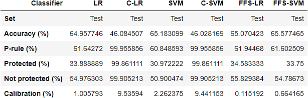

# Project 4: Machine Learning Fairness

### [Project Description](doc/project4_desc.md)

Term: Spring 2022

+ **Team**: Group 5
+ **Project title**: Maximizing Accuracy under Fairness Constraints (C-LR and C-SVM) and Information Theoretic Measures for Fairness-Aware Feature selection (FFS)
+ **Team members**:
  + [Chang Lu](cl4150@columbia.edu) (cl4150@columbia.edu)
  + [Jiaxin Yu](jy3161@columbia.edu) (jy3161@columbia.edu)
  + [Marcus Loke](https://www.linkedin.com/in/lokemarcus/) (ml4636@columbia.edu)
  + [Xiran Lin](xl3000@columbia.edu) (xl3000@columbia.edu)
  + [Zaigham Khan](https://www.linkedin.com/in/zaigham-khan-columbia/) (zak2131@columbia.edu)

+ **Project summary**: This project explores machine learning fairness on the [COMPAS dataset](https://www.propublica.org/datastore/dataset/compas-recidivism-risk-score-data-and-analysis) by comparing two methods/algorithms proposed by the following papers, (1) [Maximizing Accuracy under Fairness Constraints (C-SVM and C-LR)](doc/Fairness_Constraints_Mechanisms_for_Fair_Classification.pdf) and (2) [Information Theoretic Measures for Fairness-Aware Feature selection (FFS)](doc/Information_Theoretic_Measures_for_Fairness-aware_Feature_Selection.pdf). These algorithms shall be termed as A2 and A7 respectively throughout this project. The main aim is to predict the two-year-recidivism of black and white defendants while holding racial status as a sensitive attribute. Our A2 algorithm focuses on maximizing accuracy under fairness constraints by minimizing the loss function subject to a covariance threshold between race (sensitive attribute) and the decision boundary; while the A7 algorithm uses the joint statistics of the data to derive two information theoretic measures that can be used to quantify the accuracy and discrimination aspect for each subset of the feature space. We then evaluated each model's performance using accuracy and calibration. 

+ **Results summary**: Placeholder.

  

+ **Technologies used**: R (EDA and data cleaning) and Python (modeling work for LR, SVM, C-LR, C-SVM and FFS).
	
+ **Contribution statement**: All team members approve our work presented in this GitHub repository including this contributions statement. 
  + **Chang Lu (cl4150)** worked on the EDA and feature selection with Marcus and implemented the SVM and C-SVM algorithm. He adapted the helper function, SVM_scratch.py, and customized it for our C-SVM algorithm. He also created the function to compute calibration.
  + **Jiaxin Yu (jy3161)** worked on the unconstrained SVM, C-SVM and plotting of the calibration plots (not used in final report). 
  + **Marcus Loke (ml4636)** is the team lead for this project. He researched on the A2 paper, performed the EDA and data cleaning in R, and implemented the LR, C-LR and FFS algorithms in Python. He adapted the helper functions (utils.py, utils2.py, loss_funcs.py, helper.py) and customized it for the constrained models and he also worked with Chang on the C-SVM algorithm. He also created the function to compute p-rule. 
  + **Xiran Lin (xl3000)** 
  + **Zaigham Khan (zak2131)** researched on both A2 and A7 papers and was responsible for understanding and coding the FFS algorithm. He brought the team up to speed on the A7 method and how it differed from the A2 method. He also identified the feature to remove based on the Shapley accuracy and discrimination and worked with Marcus on the helper function, utils2.py.

Following [suggestions](http://nicercode.github.io/blog/2013-04-05-projects/) by [RICH FITZJOHN](http://nicercode.github.io/about/#Team) (@richfitz). This folder is orgarnized as follows.

```
proj/
├── lib/
├── data/
├── doc/
├── figs/
└── output/
```

Please see each subfolder for a README file.
